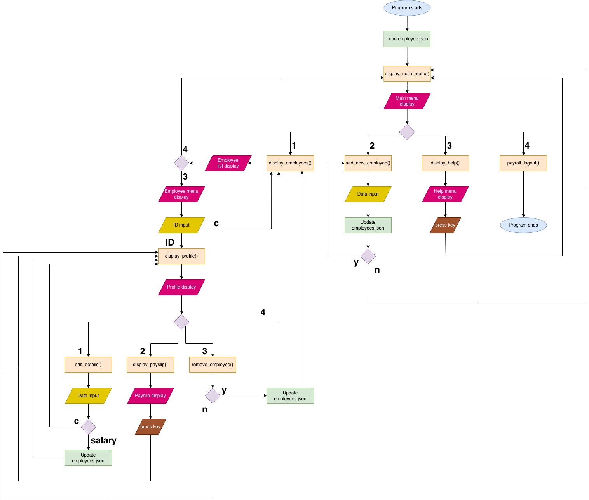

## Task 2 – Planning & Designing a Procedural Programming Application

### 1. Requirements Gathering

Before planning and designing the application, the client was interviewed and the following requirements were gathered:

**Interview questions**
- What will this application do and who will be using it?
- Is there a preference for a programming paradigm and a programming language for this application?
- How many employees does the application need to support?
- What information needs to be stored in the application?
- What calculations does the application need to do?
- What information does the application need to run those calculations?
- What will the application output to the terminal? Is there a format to follow?
- What should the application use for output? A separate UI or the terminal?
- What menu screens are needed and how should the navigation work?

The answers to these questions shaped the business and technical requirements below.

**Business Requirements:**
- Application will be used by payroll department. Only payroll team can use the application.

- Application will do the actions below:
	- display employees and detailed employee profiles,
	- add new employees to the system,
	- remove employees from the system,
	- generate a payslip for each employee,
	- edit payroll details for each employee.

- Application should support up to 50 employees.

- The information stored in the application will be:
	- Employee full name
	- Employee department and role info
	- Employee salary and PPS number

- The information needed for the application to run will be:
	- Irish PAYE, PRSI and USC rates and standard tax credits for tax calculations
	- Employee ID and salary for displaying employee profiles and payslips

- Application should be able to calculate the following for each employee:
	- Annual PAYE, PRSI, USC and total deductions
	- Annual and monthly deductions and net pay
	- Programmatically give the pay period and payment date for each payslip

- Payslip format should look similar to [this example](https://i.ytimg.com/vi/iHlnbgnlJFQ/maxresdefault.jpg).

**Technical Requirements:**
- Application should be CLI-based, written in Python and follow a procedural programming approach.

- Application should validate these user inputs and show explanatory error messages to guide the user:
	- Employee ID, PPS number and salary data when adding a new employee
	- User input when user is making choices while navigating the system

- Navigation should allow the user to jump from one menu to another and cancel an action if desired.

- Payslip should have a formatted view and be properly displayed in a (small) laptop screen since most users use a laptop rather than large desktop monitors nowadays.

### 2. Inputs, Processing, Outputs

All inputs are of `str` type as Python's `input()` function returns a string. When the inputs are used in payroll calculations, they are converted to `Decimal` for more precise financial arithmetic.

Employee records are stored as a dictionary in a .json file (`employees.json`). The dictionary keys, when needed, are converted to a `List` so indexed access and pagination is possible.

|Feature| Function|Input|Processing|Output|
|---|---|---|---|---|
|Display main menu|`display_main_menu`|User input: 1 to 4|Takes and validates user input|Routes to submenus|
|Display employee list|`display_employees()`|User input: `1` to `4`|Loads data from `employees.json`|Paginated employee list and menu options|
|Display employee menu|`display_employee_menu()`|User input: `Employee ID` or `c` for cancel|Takes and validates user input|Prompt to get user input and routes to `display_profile(id)`|
|Display employee profile|`display_profile(id)`|`Employee ID` and User input: `1` to `4`|Looks up and validates ID in employees dictionary| Detailed employee profile and employee menu options|
|Display payslip|`display_payslip(id)`|`Employee ID` and `salary`|Looks up salary data in employees dictionary and calls functions for payslip calculations|Employee payslip|
|Add new employee|`add_new_employee()`|User input: `name`, `department`, `role`, `ppsn`, `salary`| Validates user input and updates `employees.json`| Records new data in `employees.json`|
|Remove employee|`remove_employee(id)`|`Employee id` and user input: `y` or `n`|Prompt to confirm or cancel deleting the employee record|Either delete record from `employees.json` or routes to `display_profile(id)`|
|Edit employee details|`edit_details(id)`|`Employee id` and user input: `c` or `salary`| Validates user input and writes to employees.json|Routes to `display_profile(id)` with or without updating record in employees.json|
|Display help menu|`display_help()`|User input: `any key`|Displays help menu|Help content|

### 3. Employee Records Data Structure

Key: Employee ID (e.g. ID12)
Value: [name, department, role, salary, ppsn]

For example: `"ID1": ["Alice Murphy", "Engineering", "Software Developer", "34000", "1234567AB"]`

### 4. Input validations
|Function|Input|Validation Rule|
|---|---|---|
|`isID(str)`|Employee ID|Must start with ID|
|`isIDpresent(str)`|Employee ID|ID must exist in the system|
|`isValidAnswer(str)`|'y' or 'n'|Must be 'y' or 'n' or 'Y' or 'N'|
|`isValidSalary(str)`|Salary|Must be numeric only and 5-6 digits|
|`isValidLength(str)`|Employee details|Must be max 20 characters|
|`isValidPPSN(str)`|PPS Number|Must be 7 numerals followed by one or two letters. It must be unique and cannot be duplicate in the system|
|`isValidOption(str)`|1,2,3,4|Must be 1,2,3 or 4|

### Application Flowchart
The flowchart below illustrates the navigation in the system

