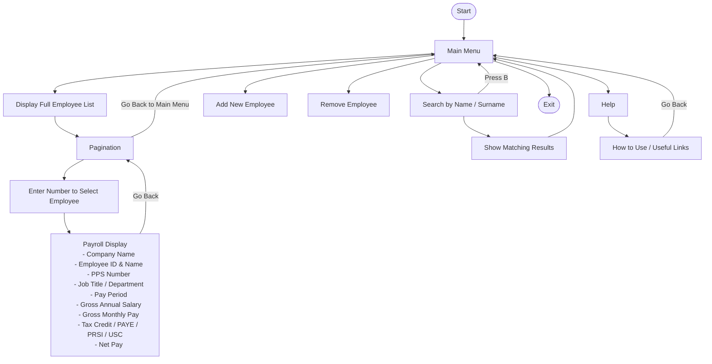

Task 2 – Planning & Designing a Procedural Programming Application

Interview outcome
More information was needed before moving on to the design stage. Client was interviewed regarding the requirements and here’s what has been learned:

Business Requirements:
Home page menu
	Options to choose from
	Sub-menus have Go back option
	Every menu has Exit option
Add a new employee
Remove an employee when their contract ends
Update employee information including salary
Search an employee
	Can look up name or surname and list all that matches
Display employee list
	Pagination
Display payroll for an employee
	Company name
	Employee name
	PPSN
	Gross salary
	Deductions
	Net salary
	Tax credit
	Monthly salary
	Weekly salary
Hold employee information for up to 50 employees
Help
	How to use the menu
	Useful links
Exit

Technical Requirements:
Validate the employee PPSN
Error handling
Calculate the taxes, gross and net amounts for weekly and monthly wages
Keep the employee information in a list and update as needed
Formatted display
Ability to navigate through a menu in all directions

Design document (diagrams)

		
